<html lang="en">
<head>
  <meta charset="UTF-8">
  <title>Audio Samples</title>

  
</head>

<body>

<h1>Master Thesis | Audio Samples</h1>
<h2>This is the title of the thesis which we dont know yet</h2>

Jonas Myhre Schiøtt, Viktor Sebastian Petersen

<table> 
  <tr>
    <th class="meta">Category</th>
    <th class="meta">Description</th>

    <th>Ground Truth</th>
    <th>w=1.5</th>
    <th>w=3.0</th>
    <th>w=7.0</th>
  </tr>

  <!-- ROW 1 -->
  <tr>
    <td class="meta">AudioCaps 839</td>
    <td class="meta">Source 1</td>

    <!-- Cell 1 -->
    <td>
      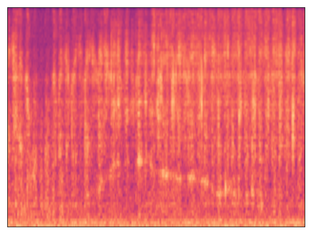
      <button class="audio-btn" onclick="toggleAudio(this, 'a1')">▶</button>
      <audio id="a1">
        <source src="audios/catdog.wav" type="audio/wav">
      </audio>
    </td>

    <!-- Cell 2 -->
    <td>
      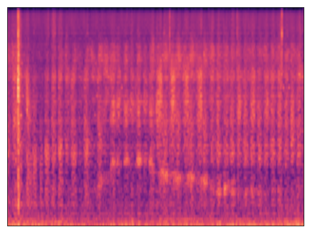
      <button class="audio-btn" onclick="toggleAudio(this, 'a1')">▶</button>
      <audio id="a1">
        <source src="audios/catdog.wav" type="audio/wav">
      </audio>
    </td>

    <!-- Cell 3 -->
    <td>
      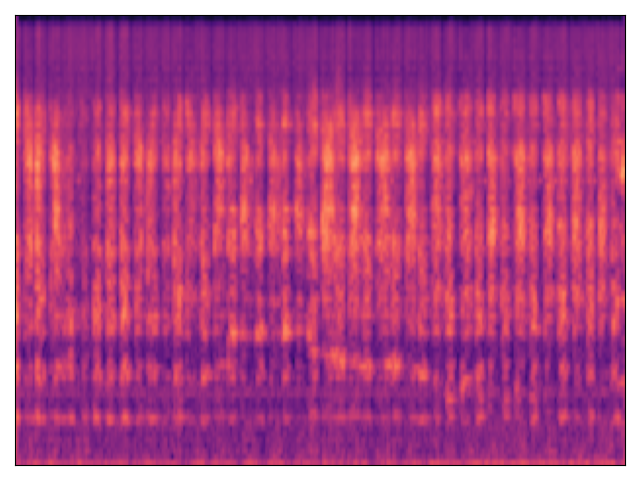
      <button class="audio-btn" onclick="toggleAudio(this, 'a1')">▶</button>
      <audio id="a1">
        <source src="audios/catdog.wav" type="audio/wav">
      </audio>
    </td>

    <!-- Cell 4 -->
    <td>
      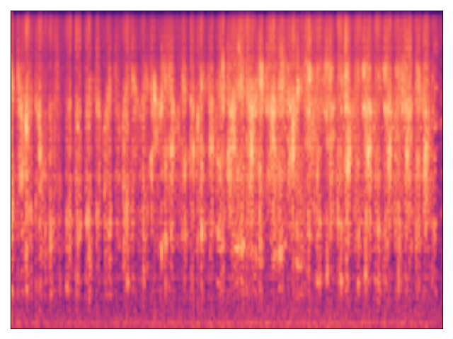
      <button class="audio-btn" onclick="toggleAudio(this, 'a1')">▶</button>
      <audio id="a1">
        <source src="audios/catdog.wav" type="audio/wav">
      </audio>
    </td>
  </tr>

  <!-- ROW 2 -->
  <tr>
    <td class="meta">AudioCaps 839</td>
    <td class="meta">Source 2</td>

    <!-- Cell 1 -->
    <td>
      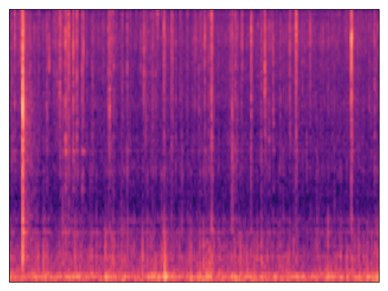
      <button class="audio-btn" onclick="toggleAudio(this, 'a1')">▶</button>
      <audio id="a1">
        <source src="audios/catdog.wav" type="audio/wav">
      </audio>
    </td>

    <!-- Cell 2 -->
    <td>
      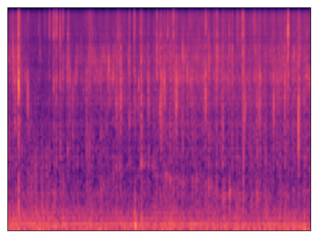
      <button class="audio-btn" onclick="toggleAudio(this, 'a1')">▶</button>
      <audio id="a1">
        <source src="audios/catdog.wav" type="audio/wav">
      </audio>
    </td>

    <!-- Cell 3 -->
    <td>
      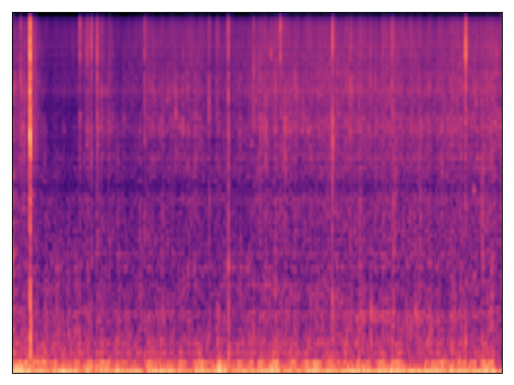
      <button class="audio-btn" onclick="toggleAudio(this, 'a1')">▶</button>
      <audio id="a1">
        <source src="audios/catdog.wav" type="audio/wav">
      </audio>
    </td>

    <!-- Cell 4 -->
    <td>
      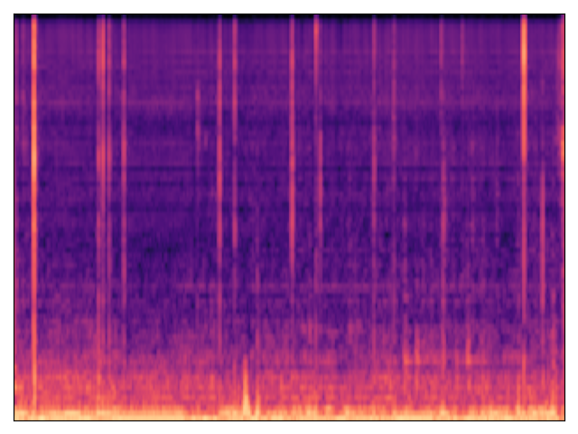
      <button class="audio-btn" onclick="toggleAudio(this, 'a1')">▶</button>
      <audio id="a1">
        <source src="audios/catdog.wav" type="audio/wav">
      </audio>
    </td>
  </tr>

  <!-- ROW 3 -->
  <tr>
    <td class="meta">AudioCaps 839</td>
    <td class="meta">Source 1 + Source 2</td>

    <!-- Cell 1 -->
    <td>
      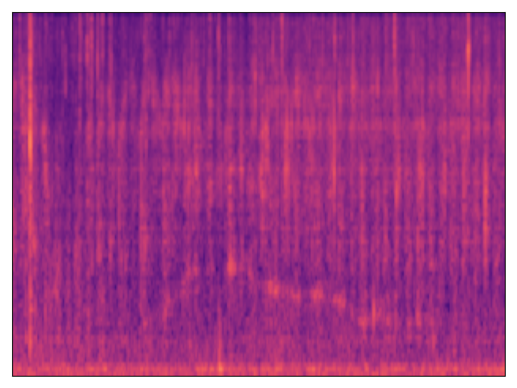
      <button class="audio-btn" onclick="toggleAudio(this, 'a1')">▶</button>
      <audio id="a1">
        <source src="audios/catdog.wav" type="audio/wav">
      </audio>
    </td>

    <!-- Cell 2 -->
    <td>
      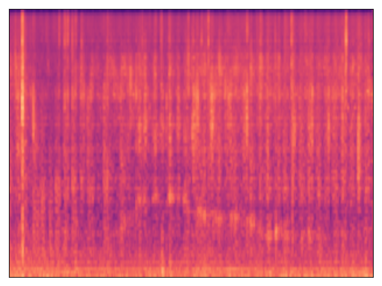
      <button class="audio-btn" onclick="toggleAudio(this, 'a1')">▶</button>
      <audio id="a1">
        <source src="audios/catdog.wav" type="audio/wav">
      </audio>
    </td>

    <!-- Cell 3 -->
    <td>
      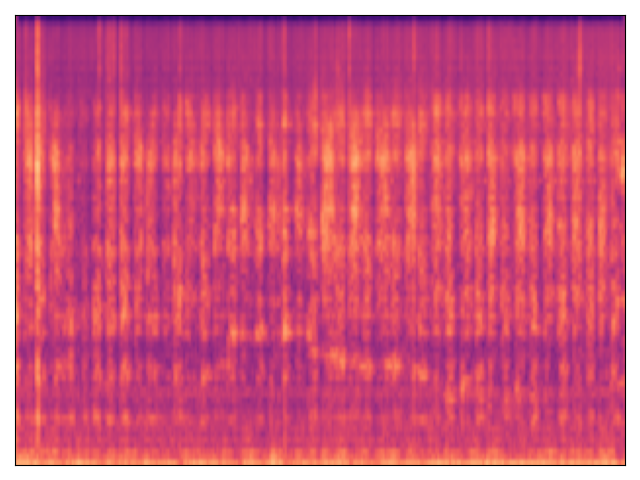
      <button class="audio-btn" onclick="toggleAudio(this, 'a1')">▶</button>
      <audio id="a1">
        <source src="audios/catdog.wav" type="audio/wav">
      </audio>
    </td>

    <!-- Cell 4 -->
    <td>
      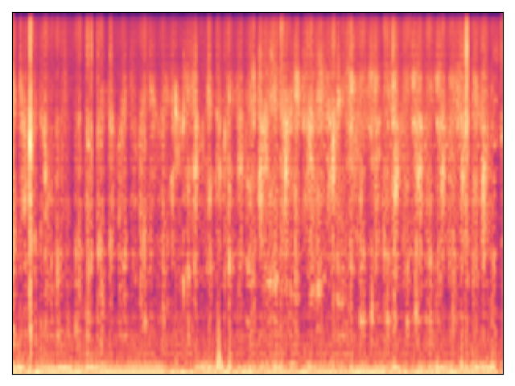
      <button class="audio-btn" onclick="toggleAudio(this, 'a1')">▶</button>
      <audio id="a1">
        <source src="audios/catdog.wav" type="audio/wav">
      </audio>
    </td>
  </tr>
</table>

</body>
</html>
